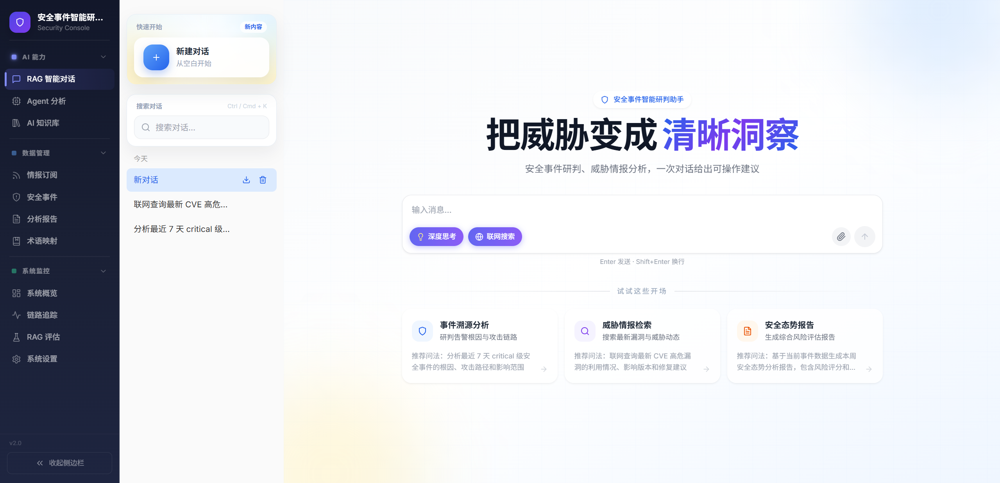
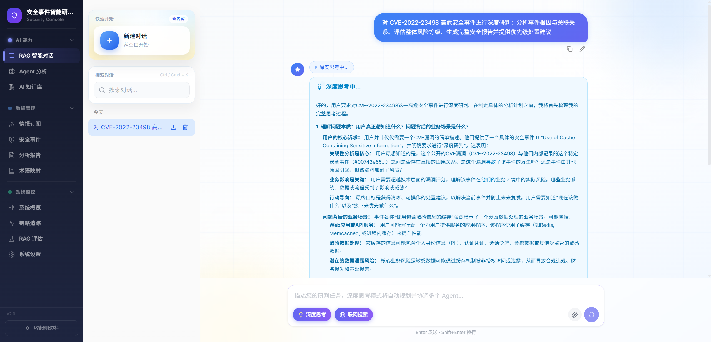
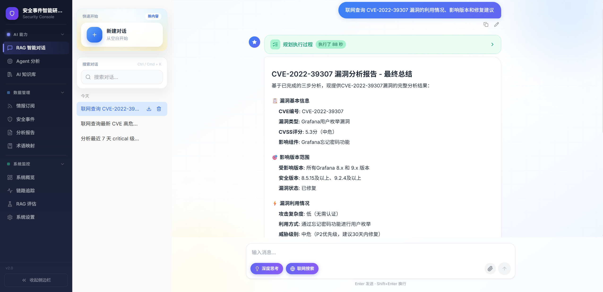
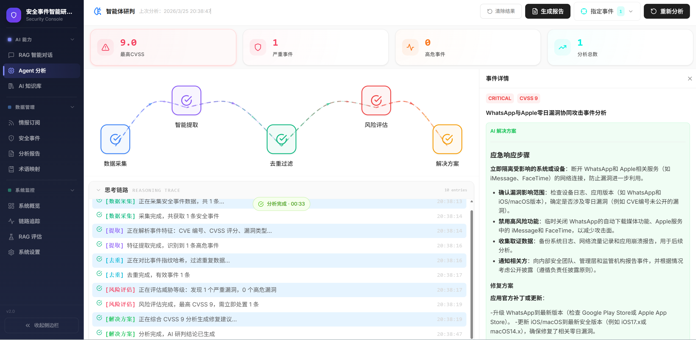
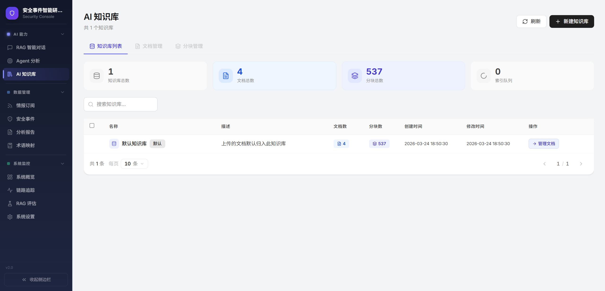
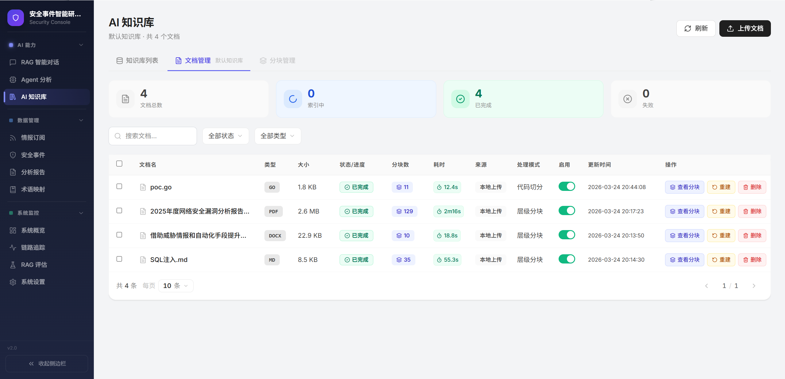
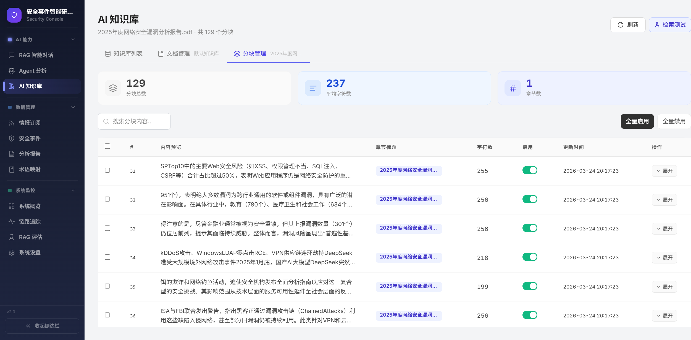
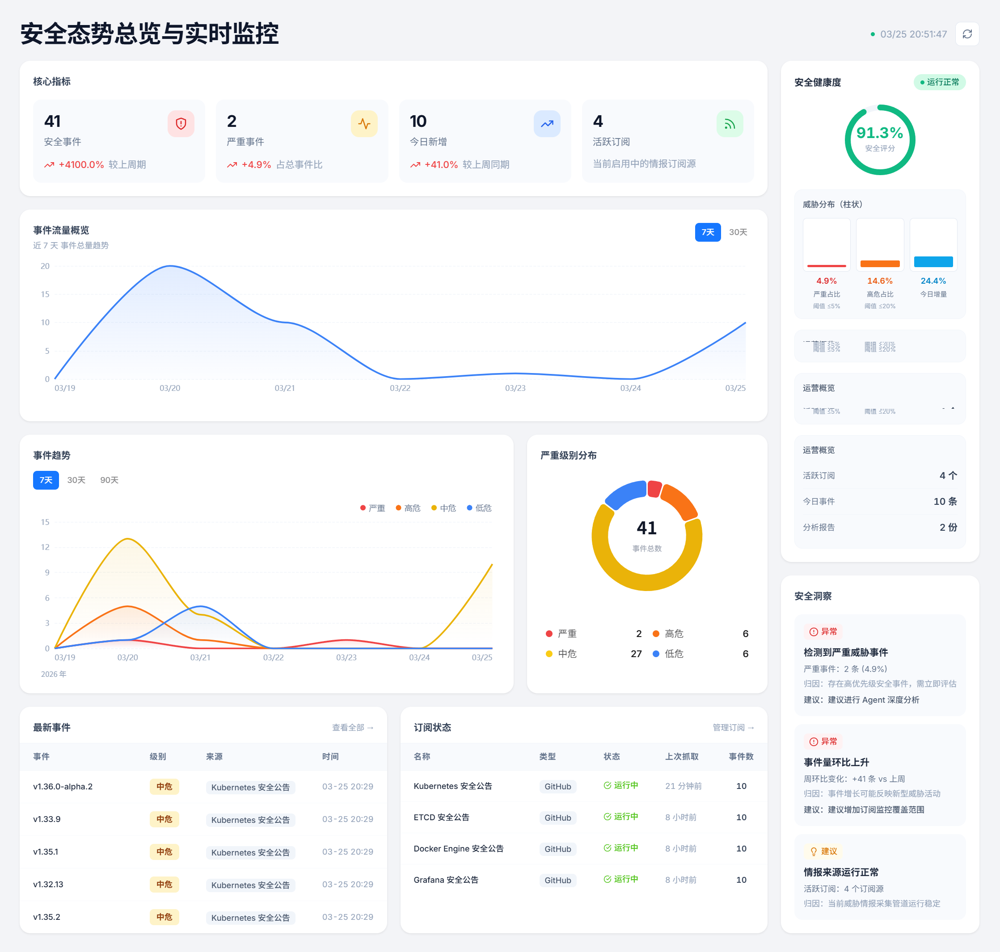
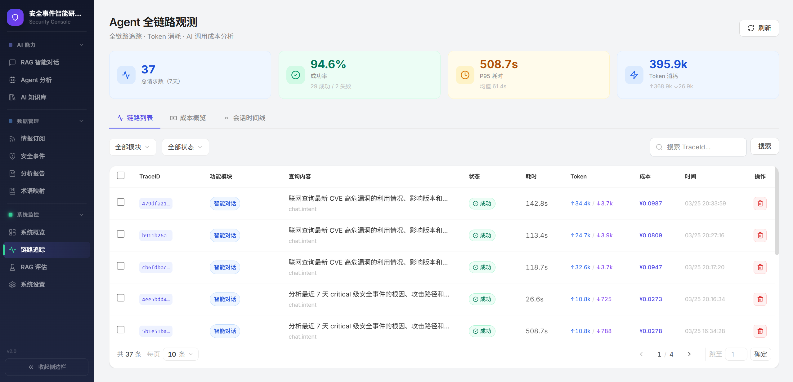
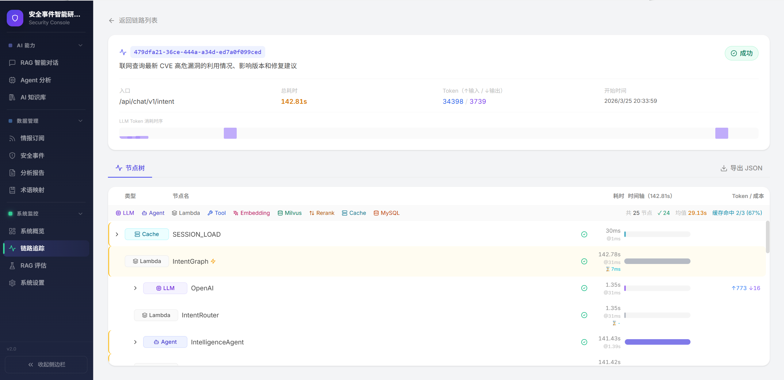

# Fo-Sentinel-Agent

**安全事件智能研判多智能体协同平台** — 通过多 Agent AI 架构自动化安全事件监控、分析与响应


---

## 目录

- [项目简介](#项目简介)
- [系统架构](#系统架构)
- [核心功能模块](#核心功能模块)
    - [1. 多 Agent 协同分析引擎](#1-多-agent-协同分析引擎)
    - [2. 深度思考模式（Plan Agent Supervisor-Worker）](#2-深度思考模式plan-agent-supervisor-worker)
    - [3. 联网威胁情报（Intelligence Agent）](#3-联网威胁情报intelligence-agent)
    - [4. RAG 增强检索管道](#4-rag-增强检索管道)
    - [5. 知识库管理](#5-知识库管理)
    - [6. 多源情报订阅与自动抓取](#6-多源情报订阅与自动抓取)
    - [7. 全链路可观测性（Trace）](#7-全链路可观测性trace)
    - [8. RAG 质量评估](#8-rag-质量评估)
    - [9. 分层记忆管理](#9-分层记忆管理)
    - [10. 结构化报告生成](#10-结构化报告生成)
    - [11. SSE 流式输出](#11-sse-流式输出)
- [技术栈](#技术栈)
- [快速开始](#快速开始)
- [部署](#部署)
- [许可证](#许可证)

---

## 项目简介

Fo-Sentinel-Agent 是面向企业安全运营的智能研判平台，通过多 Agent 协同架构实现安全事件的自动化分析与响应。系统从多源情报（漏洞库、威胁情报、厂商公告、GitHub Security Advisories）自动采集安全事件，经由 8 个专业 AI Agent 完成事件去重、关联分析、风险评估与报告生成，输出可操作的安全处置建议。

**核心能力**

- **多 Agent 协同**：8 个专业 Agent 分工协作，覆盖智能对话、联网搜索、事件分析、报告生成、风险评估、解决方案、威胁情报、摘要压缩
- **混合检索增强**：BM25 稀疏向量 + 语义稠密向量，RRF 融合排序，Rerank 精排，语义缓存加速
- **深度思考模式**：Plan-Execute-Replan 循环架构，Supervisor-Worker 协同调度，处理复杂多步骤任务
- **全链路可观测**：请求级和节点级追踪，记录耗时、成本、检索质量，支持问题定位和性能优化
- **质量评估体系**：KPI 仪表盘、用户反馈、趋势分析，量化系统表现

本项目提供了企业级安全 AI 系统的完整工程实现，涵盖多轮对话记忆、RAG 检索质量、多 Agent 编排、深度推理、可观测性等关键技术问题的解决方案。

---

**问答页面预览图：**







**Agent 事件分析页面预览图：**



**AI 知识库管理图：**







**安全态势总览与实时监控：**



**Agent 全链路观测：**





## 系统架构

```
┌─────────────────────────────────────────────────────────────────────┐
│           用户层: Web UI (React 18)  |  REST API (SSE)            │
└────────────────────────────────┬────────────────────────────────────┘
                                 ▼
┌─────────────────────────────────────────────────────────────────────┐
│ API 网关 (GoFrame v2 · :8000)                                      │
│ 路由: chat/event/report/knowledge/trace/rageval                    │
│ 中间件: JWT 认证 · SessionId · SSE 响应头                           │
└────────────────────────────────┬────────────────────────────────────┘
                                 │
                        ┌────────┴────────┐
                        │  deep_thinking? │
                        └────────┬────────┘
             ┌──── false ────────┤────── true ──────┐
             ▼                                      ▼
┌────────────────────────────┐   ┌────────────────────────────────────┐
│ 标准意图路由                │   │ Plan Agent (深度思考)              │
│ (DeepSeek V3 Quick)        │   │ (Supervisor-Worker 架构)           │
├────────────────────────────┤   ├────────────────────────────────────┤
│ 识别 6 类意图:              │   │ Planner (Think 模型):              │
│ • chat   - 通用对话         │   │  └─ 任务分解 & 步骤规划            │
│ • event  - 事件分析         │   │                                    │
│ • report - 报告生成         │   │ Executor (Quick 模型):             │
│ • risk   - 风险评估         │   │  ├─ event_analysis_agent           │
│ • solve  - 解决方案         │   │  ├─ report_agent                   │
│ • intel  - 威胁情报         │   │  ├─ risk_assessment_agent          │
│                            │   │  ├─ solve_agent                    │
│ 容错: 降级到 Chat Agent     │   │  └─ intel_agent                    │
│                            │   │                                    │
│                            │   │ Replanner:                         │
│                            │   │  └─ 继续/终止决策                  │
└────────────────────────────┘   └────────────────────────────────────┘
             │                                      │
             └──────────────────┬───────────────────┘
                                ▼
┌────────────────────────────────────────────────────────────────────────────────────────┐
│                      Agent 执行层 (8 个专业 Agent)                                    │
├────────────────────────────────────────────────────────────────────────────────────────┤
│  ┌────────┐ ┌────────┐ ┌────────┐ ┌────────┐ ┌────────┐ ┌────────┐ ┌────────┐ ┌────────┐ │
│  │ Chat   │ │ Event  │ │ Report │ │ Risk   │ │ Plan   │ │ Solve  │ │ Intel  │ │Summary │ │
│  │ Agent  │ │ Agent  │ │ Agent  │ │ Agent  │ │ Agent  │ │ Agent  │ │ Agent  │ │ Agent  │ │
│  ├────────┤ ├────────┤ ├────────┤ ├────────┤ ├────────┤ ├────────┤ ├────────┤ ├────────┤ │
│  │ ReAct  │ │ ReAct  │ │ ReAct  │ │ ReAct  │ │Superv. │ │ ReAct  │ │ ReAct  │ │Linear  │ │
│  │ +RAG   │ │ +RAG   │ │ +RAG   │ │ +RAG   │ │ Worker │ │ +RAG   │ │+Search │ │ 无 RAG │ │
│  └────────┘ └────────┘ └────────┘ └────────┘ └────────┘ └────────┘ └────────┘ └────────┘ │
│                                                                                        │
│ 工厂模式: agent.NewSingletonAgent() · sync.Once 单例初始化                            │
│ 工具注册: tools.GetMany(names) · 全局注册表按需获取                                    │
└───────────────────────────────────┬────────────────────────────────────────────────────┘
                                    │
                                    ▼
┌─────────────────────────────────────────────────────────────────────────────────────────────────┐
│                              RAG 检索层 (Hybrid Retrieval + RRF Fusion)                         │
├─────────────────────────────────────────────────────────────────────────────────────────────────┤
│  第一阶段：查询预处理 & 向量化                                                                   │
│  ┌──────────────┐    ┌──────────────┐    ┌──────────────┐    ┌──────────────┐                 │
│  │ 查询优化      │ -> │ 向量嵌入      │ -> │ 语义缓存      │ -> │ 多路检索      │                 │
│  ├──────────────┤    ├──────────────┤    ├──────────────┤    ├──────────────┤                 │
│  │术语归一化     │    │text-embed-v4 │    │Redis缓存     │    │并行执行       │                 │
│  │消除代词歧义   │    │1024维稠密向量│    │余弦≥0.85命中 │    │子查询并发     │                 │
│  │拆分子问题     │    │估算Token成本 │    │TTL 24小时    │    │结果去重合并   │                 │
│  └──────────────┘    └──────────────┘    └──────────────┘    └──────────────┘                 │
│                                                                      ↓                          │
│  第二阶段：混合检索 & 精排过滤                                                                   │
│  ┌──────────────┐    ┌──────────────┐    ┌──────────────┐    ┌──────────────┐                 │
│  │ 混合检索      │ -> │ 精排重打分    │ -> │ 过滤截断      │ -> │ 返回上下文    │                 │
│  ├──────────────┤    ├──────────────┤    ├──────────────┤    ├──────────────┤                 │
│  │Milvus双路     │    │qwen3-rerank  │    │MinScore≥0.30 │    │FinalTopK=3   │                 │
│  │Dense语义匹配  │    │精排模型打分   │    │过滤低分文档   │    │送入LLM上下文 │                 │
│  │Sparse词匹配   │    │提升Top质量   │    │TopK截断控制  │    │平衡质量成本   │                 │
│  │RRF融合k=60   │    │              │    │              │    │              │                 │
│  └──────────────┘    └──────────────┘    └──────────────┘    └──────────────┘                 │
└─────────────────────────────────────────────────────────────────────────────────────────────────┘
                                  │
                                  ▼
┌─────────────────────────────────────────────────────────────────────┐
│                        知识库管理层 (Knowledge Base)                 │
├─────────────────────────────────────────────────────────────────────┤
│  文档上传: PDF / Markdown / Docx / Code                             │
│                                                                     │
│  分块策略 (自动选择):                                                │
│  • structure_aware  - Markdown 文档 (保留结构)                      │
│  • hierarchical     - 其他格式 (层次分块)                           │
│                                                                     │
│  索引构建: 文档分块 → Embedder → Milvus (documents 分区)             │
│                                                                     │
│  向量管理: 启用/禁用文档 · 相似度搜索 · 分块查看                      │
└─────────────────────────────────┬───────────────────────────────────┘
                                  │
                                  ▼
┌─────────────────────────────────────────────────────────────────────┐
│                          工具调用层 (11 个工具)                      │
├─────────────────────────────────────────────────────────────────────┤
│  ┌─ event/ ──────────────┐  ┌─ report/ ─────────────────────────┐  │
│  │ • query_events         │  │ • query_reports                   │  │
│  │ • search_similar_events│  │ • query_report_templates          │  │
│  │ • query_subscriptions  │  │ • create_report                   │  │
│  └────────────────────────┘  └───────────────────────────────────┘  │
│                                                                     │
│  ┌─ intelligence/ ───────┐  ┌─ system/ ─────────────────────────┐  │
│  │ • web_search (Tavily)  │  │ • get_current_time                │  │
│  │ • save_intelligence    │  │ • query_database                  │  │
│  └────────────────────────┘  │ • query_internal_docs             │  │
│                               └───────────────────────────────────┘  │
└─────────────────────────────────┬───────────────────────────────────┘
┌─────────────────────────────────────────────────────────────────────┐
│                            存储层 (Storage)                        │
├─────────────────────────────────────────────────────────────────────┤
│  ┌─────────────────┐  ┌─────────────────┐  ┌─────────────────┐    │
│  │ MySQL           │  │ Redis           │  │ Milvus          │    │
│  ├─────────────────┤  ├─────────────────┤  ├─────────────────┤    │
│  │ • events        │  │ 语义缓存:        │ │ • 事件向量       │    │
│  │ • reports       │  │   └─ 余弦 >= 0.85│ │ • 文档向量       │    │
│  │ • subscriptions │  │   └─ TTL 24h     │ │ • 知识分块       │    │
│  │ • trace_runs    │  │                  │ │ • 相似检索       │    │
│  │ • trace_nodes   │  │ 分层记忆:        │ │ • 分区隔离       │    │
│  │ • kb_documents  │  │   └─ 短期: 最近 N │ │   (events/docs) │    │
│  │ • feedbacks     │  │   └─ 长期: 摘要   │ │                  │    │
│  │                 │  │   └─ TTL 30 天    │ │ 混合检索:        │    │
│  │                 │  │                  │ │   └─ Dense+Sparse│    │
│  │                 │  │ 会话管理:        │ │   └─ RRF 融合    │    │
│  │                 │  │   └─ session_id   │ │                  │    │
│  └─────────────────┘  └─────────────────┘  └─────────────────┘    │
│                                                                     │
│  ┌───────────────────────────────────────────────────────────────┐  │
│  │ Scheduler (后台调度器 · goroutine)                            │  │
│  │ • Fetcher: RSS/GitHub 情报抓取 → MySQL (每 15 分钟)          │  │
│  │ • Indexer: 文档向量嵌入 → Milvus (每 20 分钟)                │  │
│  └───────────────────────────────────────────────────────────────┘  │
└─────────────────────────────────┬───────────────────────────────────┘
                                  │
                                  ▼
┌─────────────────────────────────────────────────────────────────────┐
│                      全链路可观测性 (Observability)                  │
├─────────────────────────────────────────────────────────────────────┤
│  9 种节点追踪:                                                       │
│  • Eino 自动埋点: LLM / TOOL / RETRIEVER / EMBEDDING / LAMBDA       │
│    └─ 通过 callbacks.Handler 自动捕获 OnStart/OnEnd/OnError        │
│  • 手动埋点: AGENT / CACHE / DB / RERANK                            │
│    └─ StartSpan/FinishSpan 包裹关键逻辑                             │
│                                                                     │
│  性能监控:                                                           │
│  • 慢查询检测 - 阈值 100ms，记录完整 SQL                            │
│  • Token 消耗统计 - 按模型分类统计 input/output tokens              │
│  • 成本计算 - 根据模型单价实时计算费用                              │
│  • 异步写入 - goroutine 批量写入，零阻塞主流程                      │
│                                                                     │
│  关键特性:                                                           │
│  • 上下文传递 - ActiveTrace 通过 context 跨组件传递                 │
│  • SpanStack - 支持嵌套 span，自动维护父子关系                      │
│                                                                     │
│  数据存储: agent_trace_runs / agent_trace_nodes (MySQL)             │
└─────────────────────────────────┬───────────────────────────────────┘
                                  │
                                  ▼
┌─────────────────────────────────────────────────────────────────────┐
│                      RAG 质量评估 (Quality Assessment)               │
├─────────────────────────────────────────────────────────────────────┤
│  KPI 指标:                                                           │
│  • 缓存命中率                                                       │
│  • 平均检索耗时                                                     │
│  • Token 消耗 & 成本趋势                                            │
│                                                                     │
│  用户反馈:                                                           │
│  • 满意度统计                                                       │
│  • 问题回溯                                                         │
│  • 质量趋势分析                                                     │
│                                                                     │
│  数据存储: message_feedbacks                                        │
└─────────────────────────────────────────────────────────────────────┘
```

---

## 核心功能模块

### 1. 多 Agent 协同分析引擎

安全事件研判需要多维度专业能力协同：关联历史事件、评估风险等级、生成处置方案、输出分析报告。系统通过 8 个专业 Agent 分工协作，每个 Agent 专注特定领域，通过意图路由实现智能分发。

#### 主要流程

```
用户消息 → 意图识别 (Router LLM) → 路由决策
                                      ↓
                    ┌─────────────────┴─────────────────┐
                    ▼                                   ▼
            标准意图路由                               深度思考模式
            (单一任务)                                (复杂多步骤)
                    ↓                                   ↓
        ┌───────────┴───────────┐                   Plan Agent
        ▼           ▼           ▼                Supervisor-Worker
    Chat Agent  Event Agent  Report Agent             协同调度
    Risk Agent  Solve Agent  Intel Agent                ↓
    Summary Agent (8个专业Agent)                   Planner 任务分解
                    ↓                                   ↓
            工具调用 + RAG检索 + 联网搜索             Executor 调度执行 (调用 Worker Agent)
            (Intel Agent 调用 web_search)                ↓ 
            流式返回结果                            Replanner 评估决策
                                                        ↓
                                                   循环反馈直至完成
```

**核心特性**

- **意图自动识别**：Router LLM 快速识别用户意图，支持 chat/event/report/risk/solve/intel 六类任务分类
- **容错降级机制**：识别失败或置信度不足时自动降级到 Chat Agent 兜底，保证系统可用性
- **工厂模式管理**：所有 Agent 通过单例工厂统一管理，使用 sync.Once 保证线程安全的懒初始化
- **工具按需加载**：全局工具注册表支持按名称获取工具子集，包含事件查询、报告生成、情报搜索、系统工具四大类共11个工具

---

### 2. 深度思考模式（Plan Agent Supervisor-Worker）

复杂安全任务往往需要多个 Agent 协同完成，如"分析近期高危事件、评估风险、生成处置报告"。深度思考模式通过 Plan-Execute-Replan 循环架构，实现多步骤任务的自动规划与执行。

#### 主要流程

```
用户请求 (deep_thinking=true)
        ↓
    Planner 任务分解 (Think 模型)
    - 分析用户意图和复杂度
    - 拆解为多个子任务步骤
    - 生成执行计划
        ↓
    Executor 调度执行 (Quick 模型)
    - 根据计划调用 Worker Agent:
      · event_analysis_agent (事件分析)
      · report_agent (报告生成)
      · risk_assessment_agent (风险评估)
      · solve_agent (解决方案)
      · intel_agent (联网搜索)
    - 注入历史上下文 (进程内 SessionMemory)
        ↓
    Worker 执行任务
    - RAG 检索相关知识
    - 联网搜索最新情报
    - 调用专业工具
    - 返回执行结果 (自动截断防溢出)
        ↓
    Replanner 评估决策 (Think 模型)
    - 检查任务完成度
    - 判断是否需要继续
    - 决策: 继续执行 / 终止返回
        ↓
    循环反馈直至完成
```

**核心特性**

- **Supervisor-Worker 架构**：Planner 负责任务分解和步骤规划，Executor 调度 Worker 工具执行具体任务，Replanner 评估执行结果并决策下一步
- **Worker 上下文隔离**：每个 Worker 通过独立 context 派生，避免 Eino compose state 冲突，保证执行环境干净
- **历史上下文传递**：从进程内 SessionMemory 提取最近对话历史注入查询，Worker 能感知对话背景，零 Redis 开销
- **输出截断防溢出**：Worker 返回值自动截断，防止上下文爆炸影响后续推理质量

---

### 3. 联网威胁情报（Intelligence Agent）

传统 RAG 仅能检索已有知识，面对新出现的 CVE、零日漏洞、最新攻击组织动态时存在盲区。Intelligence Agent 通过集成联网搜索能力，实现实时威胁情报获取与沉淀。

#### 主要流程

```
Intelligence Agent (ReAct + 联网搜索)
        ↓
    判断是否需要联网搜索
    - 检查前端联网开关状态
    - 评估查询是否需要实时信息
        ↓
    web_search 工具调用
    - Tavily API 深度搜索模式
    - 搜索最新 CVE、零日漏洞、攻击组织动态
    - 返回高质量搜索结果
        ↓
    LLM 分析总结
    - 提取关键信息 (漏洞详情/影响范围/修复方案)
    - 评估信息可信度
    - 生成结构化情报摘要
        ↓
    save_intelligence 工具调用
    - 写入 MySQL events 表
    - 标记来源为联网搜索
    - 记录时间戳和元数据
        ↓
    异步 Indexer 向量化
    - 后台定时任务触发
    - text-embedding-v4 向量化
    - 写入 Milvus (events 分区)
        ↓
    下次检索可直接命中
```

**核心特性**

- **专业搜索引擎集成**：接入 Tavily Search API，支持深度搜索模式，结果质量优于通用搜索引擎
- **情报自动沉淀**：Agent 分析总结的情报自动写入数据库，触发异步向量化，下次检索可直接命中
- **联网开关控制**：前端提供联网搜索开关，关闭时工具返回提示而不执行实际搜索，避免不必要的 API 消耗
- **职责单一设计**：专注"联网采集 → 分析 → 沉淀"流程，不与本地事件工具混用，避免角色混淆

---

### 4. RAG 增强检索管道

简单的向量检索难以满足生产需求。系统构建了完整的检索管道，涵盖查询优化、混合检索、精排过滤和缓存策略，系统性解决检索质量问题。

#### 主要流程

```
用户查询
        ↓
    查询优化 (Normalize/Rewrite/Split)
    - 术语归一化 (统一专业术语)
    - 消除代词歧义 (补全上下文)
    - 拆分子问题 (复杂查询分解)
        ↓
    向量嵌入 (text-embedding-v4)
    - 生成 1024 维稠密向量
    - 估算 Token 成本
        ↓
    语义缓存检查 (Redis)
    - 计算余弦相似度
    - 阈值 >= 0.85 命中缓存
    - TTL 24 小时
        ↓ (未命中)
    混合检索 (Milvus)
    - Dense 路径: 稠密向量 + COSINE 相似度
    - Sparse 路径: BM25 稀疏向量 + IP 内积
    - RRF 融合排序 (k=60)
    - 多路并行检索 (子查询并发)
        ↓
    Rerank 精排 (qwen3-rerank)
    - 精排模型重新打分
    - 提升 Top 结果质量
        ↓
    过滤截断
    - MinScore 过滤低分文档
    - FinalTopK 截断控制数量
        ↓
    返回文档上下文 (送入 LLM)
```

**核心特性**

- **查询优化三段式**：术语归一化消除歧义，查询重写补全上下文，子问题拆分提升召回完整性
- **混合检索策略**：稠密向量捕捉语义相似性，稀疏向量精确词匹配，RRF 算法自动融合排序无需手动调权
- **语义缓存加速**：Redis 缓存检索结果，相似查询直接命中跳过向量检索，显著降低延迟
- **Rerank 精排提升**：精排模型重新打分，提升 Top 结果质量，过滤低分文档控制上下文质量

---

### 5. 知识库管理

安全团队积累的内部知识需要系统化管理，才能在 RAG 检索时精准命中。系统支持多格式文档上传、智能分块策略和全生命周期管理。

#### 主要流程

```
Web 上传文件
        ↓
    文件保存到本地存储
        ↓
    Worker Pool 异步处理
        ↓
    文档解析 (PDF/DOCX/Markdown/Code)
        ↓
    智能分块策略选择
    - Markdown → structure_aware (保留结构)
    - 其他格式 → hierarchical (父子分块)
    - 代码文件 → code (语法感知)
        ↓
    向量化 (text-embedding-v4)
        ↓
    Milvus 索引写入 (documents 分区)
        ↓
    状态更新 (pending → indexed)
```

**核心特性**

- **多知识库隔离**：支持创建多个知识库，通过元数据字段逻辑隔离
- **智能分块策略**：基于文件类型自动选择，父子结构感知分块，滑动窗口分块，代码语法感知分块
- **多格式解析器**：支持 PDF/DOCX/Markdown/代码文件，三阶段 fallback 处理异常文档
- **全生命周期管理**：状态追踪，支持重建索引

---

### 6. 多源情报订阅与自动抓取

安全运营需要持续获取最新威胁情报。系统通过订阅机制自动抓取多源情报，实现情报的自动化采集与入库。

#### 主要流程

```
Scheduler 定时调度 (goroutine 后台运行)
        ↓
    RSS Fetcher / GitHub Fetcher 并行抓取
    - RSS 订阅源 (厂商安全公告)
    - GitHub Security Advisories (开源漏洞)
        ↓
    内容解析与提取
    - 标题、描述、链接、发布时间
    - CVE 编号、影响范围
        ↓
    去重检查 (SHA256 内容哈希)
    - 计算内容指纹
    - 查询 MySQL 是否已存在
        ↓
    MySQL 入库 (status=pending)
    - 写入 events 表
    - 记录来源和元数据
        ↓
    Indexer 批量向量化 (定时触发)
    - 读取 pending 状态事件
    - text-embedding-v4 向量化
    - 更新状态为 indexed
        ↓
    Milvus 索引写入 (events 分区)
    - 写入稠密向量
    - 写入稀疏向量 (BM25)
    - 供 RAG 检索使用
```

**核心特性**

- **多协议支持**：RSS 订阅和 GitHub Security Advisories 两种抓取方式，覆盖主流情报来源
- **自动定时抓取**：后台调度器定时执行，全程无需人工干预
- **智能去重机制**：基于内容哈希去重，避免重复数据
- **异步向量化**：新事件入库后批量向量化，不阻塞主流程

### 7. 全链路可观测性（Trace）

AI 系统问题定位困难，需要全链路追踪每个环节的耗时、成本和质量指标。系统通过多层埋点实现完整的可观测性。

#### 主要流程

```
Controller 接收请求
        ↓
    StartRun 创建追踪会话 (trace_id/session_id)
        ↓
    Eino Callbacks 自动埋点
    - LLM 调用 (模型名/tokens/耗时)
    - TOOL 调用 (工具名/参数/结果)
    - RETRIEVER 检索 (召回数/相似度)
    - EMBEDDING 向量化 (tokens/成本)
        ↓
    手动 Span 埋点
    - AGENT 执行 (意图/状态)
    - CACHE 操作 (命中/未命中)
    - RERANK 精排 (分数分布)
        ↓
    GORM Plugin 自动埋点
    - DB 慢查询检测 (阈值/SQL语句)
        ↓
    异步批量写入 MySQL
    - agent_trace_runs (请求级汇总)
    - agent_trace_nodes (节点级明细)
        ↓
    FinishRun 计算总耗时和成本
```

**核心特性**

- **两级数据结构**：请求级记录总耗时和成本，节点级记录每个处理环节的详细信息
- **多种埋点方式**：Eino callbacks 自动埋点，手动 Span 包装，GORM Plugin 拦截数据库操作
- **检索质量指标**：记录召回文档数、相似度分数、Rerank 分数，量化检索质量
- **成本估算**：根据 Token 消耗和模型单价计算成本，支持多模型成本分布分析

---

### 8. RAG 质量评估

追踪系统告诉你每次请求发生了什么，RAG 质量评估模块告诉你系统整体表现如何。

#### 主要流程

```
agent_trace_runs/nodes 数据源
        ↓
    KPI 指标聚合计算
    - 成功率 (status='success' 占比)
    - 平均延迟 & P95 延迟
    - 平均召回文档数
    - 平均最高相似度分
    - 缓存命中率 (CACHE 节点统计)
    - 平均 Rerank 分数
        ↓
    模型成本分布统计
    - LLM 模型 (DeepSeek V3 Think/Quick)
    - Embedding 模型 (text-embedding-v4)
    - Rerank 模型 (qwen3-rerank)
    - 按模型聚合 Token 消耗和成本
        ↓
    用户反馈收集
    - 点赞/点踩写入 message_feedbacks
    - 按 (session_id, message_index) 唯一标识
        ↓
    ECharts 可视化渲染
    - 响应耗时趋势图
    - 检索得分趋势图
    - 成本分布饼图
        ↓
    链路关联查询
    - 按 session_id 筛选
    - 点击跳转 Trace 详情
```

**核心特性**

- **KPI 仪表盘**：聚合成功率、延迟、召回文档数、相似度分数、缓存命中率等关键指标
- **模型成本分布**：按模型名称统计 Token 消耗和成本占比，支持多模型成本分析
- **用户反馈系统**：聊天界面支持点赞/点踩，统计满意度趋势
- **链路关联**：按 session_id 筛选具体链路，点击查看 Trace 详情定位根因

---

### 9. 分层记忆管理

对话历史全量送入 LLM 会导致 Token 快速增长和成本飙升。系统通过分层记忆和自动摘要机制，在控制成本的前提下保留关键上下文。

#### 主要流程

```
对话消息累积
        ↓
    触发检查 (双重阈值)
    - 消息数超过阈值
    - Token 数超过阈值
        ↓
    Summary Agent 压缩 (线性流水线)
    - 提取最早的 N 条消息
    - LLM 生成摘要 (保留关键信息)
    - 无 RAG 干扰，专注压缩
        ↓
    构建新的记忆结构
    - 短期记忆: 保留最近 M 条消息原文
    - 长期记忆: 历史摘要文本
    - 两层结构平衡上下文和成本
        ↓
    Redis 持久化 (TTL 30 天)
    - 按 session_id 存储
    - 包含短期消息 + 长期摘要
    - 服务重启后可恢复
        ↓
    进程内 SessionMemory 更新
    - 同步更新内存缓存
    - 后续对话直接使用
```

**核心特性**

- **两层记忆结构**：短期记忆保留最近消息原文，长期记忆压缩为摘要
- **双重触发机制**：消息数和 Token 数双重阈值触发摘要
- **Summary Agent 流水线**：线性流水线专注压缩，无 RAG 干扰
- **跨会话持久化**：Redis 存储对话历史，服务重启后可继续对话

---

### 10. 结构化报告生成

安全团队每周/每月需要输出安全报告，手工整理数据、写分析、排版耗时巨大。Report Agent 自动完成这个过程。

#### 主要流程

```
Report Agent (ReAct + RAG)
      ↓
query_events → 获取时间范围内事件数据
      ↓
query_report_templates → 获取报告模板
      ↓
RAG 检索 → 相关历史事件和内部文档
      ↓
LLM 生成 → 结构化报告内容
      ↓
create_report → 持久化到 MySQL reports 表
```

**核心特性**

- **多类型报告**：支持周报、月报、自定义报告，对应不同的时间范围和分析维度
- **工具链协同**：通过工具获取事件数据和模板，ReAct 推理生成内容，自动持久化
- **历史报告检索**：支持按时间范围、类型过滤查询历史报告，参考历史写法和结构
- **RAG 增强**：通过 Milvus 检索相关历史事件和内部文档，保证报告内容有据可查

---

### 11. SSE 流式输出

AI 分析可能需要数十秒才能完成，如果等分析完再一次性返回，用户体验极差。系统所有 AI 分析过程都通过 Server-Sent Events 实时推流，用户可以看到推理步骤和工具调用过程。

#### 主要流程

```
Controller 接收请求
        ↓
    推送 meta 事件 (sessionId/timestamp)
        ↓
    推送 status 事件 (Agent 路由状态)
        ↓
    流式推送内容块 (chat/event/report/risk/solve/intel/plan)
        ↓
    推送 done 事件 (流结束)
```

**核心特性**

- **多类型事件**：支持 meta、status、内容流、plan_step、error、done 等事件类型
- **按意图分类**：标准模式按 Agent 类型推送，深度思考模式推送 plan_step 和 plan 事件
- **实时反馈**：用户可实时看到 Agent 推理步骤、工具调用过程和中间结果
- **异常处理**：错误时推送 error 事件，保证前端能正确处理异常情况

---

---

## 技术栈

| 层次 | 技术 | 说明 |
|------|------|------|
| 后端框架 | GoFrame v2.7.1 | HTTP 服务器、配置管理、日志 |
| AI 编排 | Cloudwego Eino | 多 Agent 管道编排、ReAct、Graph、Plan-Execute-Replan |
| 对话模型 | DeepSeek V3 | 主要推理与分析（OpenAI 兼容接口） |
| 嵌入模型 | DashScope text-embedding-v4 | 向量嵌入 |
| Rerank 模型 | DashScope qwen3-rerank | 检索结果重排序精排 |
| 联网搜索 | Tavily Search API | 专为 AI Agent 设计的搜索接口 |
| 关系数据库 | MySQL 8.0+ | 事件、订阅、报告、用户、知识库、追踪持久化 |
| 向量数据库 | Milvus 2.x | 事件/文档向量检索（RAG） |
| 缓存 | Redis 7.x | 语义缓存 + 对话历史 + 会话摘要 |
| 前端 | React 18 + TypeScript + Vite | 现代化 Web 界面 |
| 状态管理 | Zustand | 前端全局状态 |
| 样式 | TailwindCSS | 响应式 UI |
| 图表 | ECharts | 趋势图、分布图 |

---

## 快速开始

### 前置条件

- Go 1.24+
- Node.js 18+ / npm
- MySQL 8.0+
- Redis 7.x
- Milvus 2.x（可选，关闭 RAG 可不启动）

### 1. 克隆仓库

```bash
git clone https://github.com/your-org/fo-sentinel-agent.git
cd fo-sentinel-agent
```

### 2. 启动依赖服务

```bash
docker compose -f manifest/docker/docker-compose.yml up -d
```

### 3. 配置

复制并编辑配置文件：

```bash
cp manifest/config/config.yaml manifest/config/config.local.yaml
```

配置 API Key 和数据库连接信息，详见 `manifest/config/config.yaml` 注释说明。

### 4. 启动后端

```bash
go mod tidy
go run main.go
# 服务运行在 http://localhost:8000
```

### 5. 启动前端

```bash
cd web
npm install
npm run dev
# 前端运行在 http://localhost:3001
```

## 部署

### 开发环境

```bash
# 启动所有依赖服务
docker compose -f manifest/docker/docker-compose.yml up -d

# 查看服务状态
docker compose -f manifest/docker/docker-compose.yml ps
```

### 生产环境

```bash
# 构建后端
go build -o fo-sentinel-agent main.go

# 构建前端
cd web && npm run build
```

**生产部署建议：**

- 修改默认管理员密码
- 启用 JWT 认证
- 配置 HTTPS 反向代理
- 配置 Redis 持久化
- 使用 Milvus 生产集群
- 监控 LLM API 配额
- 配置日志收集与告警

## 许可证

MIT License — 详见 [LICENSE](LICENSE) 文件

---

## 贡献

欢迎提交 Issue 和 Pull Request。提交代码前请确保：

```bash
go fmt ./...      # 格式化代码
go vet ./...      # 静态检查
go test ./...     # 运行测试
```
